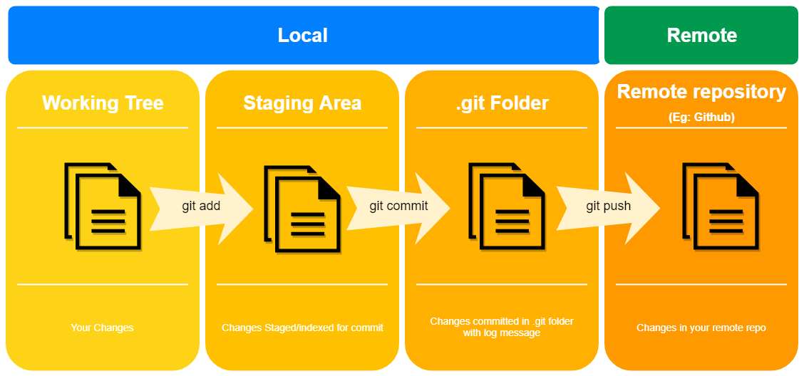
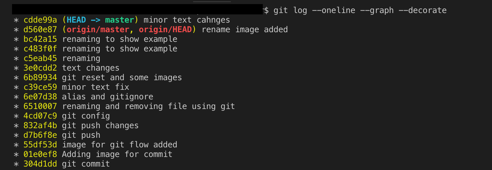
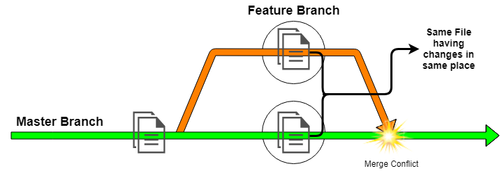
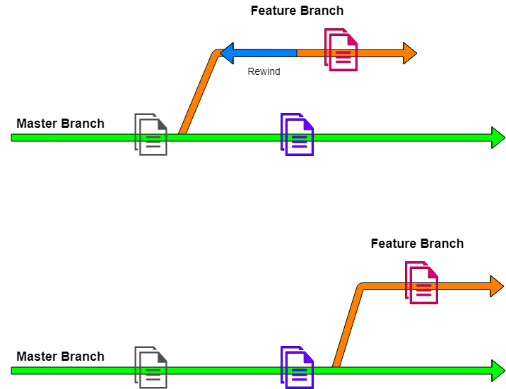
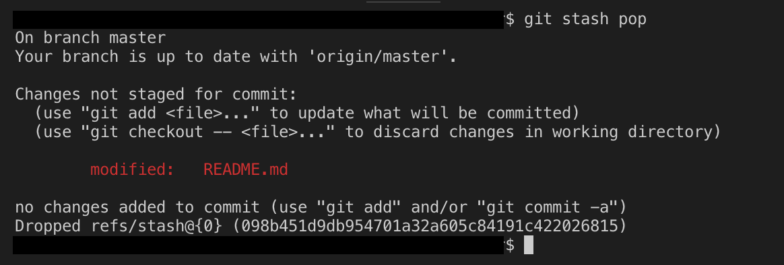

# Introduction to Git

In a nutshell, Git is a distributed source-control or version-control system which helps in keeping track of the changes in source code and also helps developers to coordinate during any software development. To read more about its origin, design, developers, etc., you can go to this [wikipedia link to git](https://en.wikipedia.org/wiki/Git "Wikipedia link to git")

### Topics

* [Git Installation](#Git-Installation "Goto Git Installation")
* [Basic Git Command](#Basic-Git-Command "Goto Basic Git Command")
* [Branching](#Branching "Goto Branching")
* [Rebasing](#Rebasing "Goto Rebasing")
* [Stashing](#Stashing "Goto Stashing")
* [Tagging](#Tagging "Goto Tagging")

    
## Git Installation

Git installation is pretty straight forward.

__On Windows__

You just have to download the installer from [git-scm.com](https://git-scm.com/downloads "git-scm.com"), and then run it, that's it. Git will be installed.

__On Mac OS__

If you have XCode installed on your MAC then you do not need to do anything, git will already be there, if not then you have to just run command "__git version__" in your terminal and MAC will prompt you to install either XCode or command line developer tools, you can choose to install just command line tools if you don't want to install XCode. 

## Basic Git Command

__git init__

> Create an empty Git repository or reinitialize an existing one

`git init`

As mentioned in the blockquote above this command is used to initialize the git repo. So basically you can use it for different scenarios.

__-> While creating new project__

Just type the below command in your terminal/command prompt

`git init project-name  //you can replace project-name with your own project name`

__->Reinitializing the existing project__

For this scenario you have to first navigate to your project folder, then just type git init.

```
cd project-name 
git init
```
Once you run this command a project folder is setup which contains __.git__ folder this folder keeps the track of the working tree's changes/activities.

__git status__

> Get the working tree status

This command gives information about the status of the working tree compared to the git repository. Type the command:

`git status`

and you get information something like below image.


As you can see in the image above, it shows two types of files one is tracked and other is untracked.
Tracked files are those which git is already aware of and are just modified. Untracked files are those which are newly added and git is not keeping track of it.

One more thing to notice in the above image is the line "__Your branch is ahead of origin/master by 1 commit__", this is the summary of the current status of the working tree concerning git repository.

__git add__

> Adding file contents to index/staging area

This command updates the index using the current content found in the working tree, to prepare the content staged for the next commit. Type the command:

`git add file_path`

Multiple files can be added by giving the filenames comma(,) separated.

`git add file1_path,file2_path`

or you can add all files together by using a dot(.) in place of the filename as:

`git add .`


So if you run `git status` now you will see the files which were previously coming as not staged and/or untracked files in red color, are now coming as staged and ready to commit in green color.

What happens when we run `git add` is, the "index" holds the snapshot of the content of working tree, this snapshot is taken as the content for the next commit.

Before running the commit command you can run this command as many times as you want, but after running the commit command if you run this command than content/changes will be staged for the next commit.

__git commit__

> Record changes to the repository(.git folder) but still in the local

This command creates a new commit containing the current contents of the index(the snapshot) and the given log message describing the changes. Just type the command:

`git commit -m "Log Message explaining the change"`

if you miss out giving the log message and just type `git commit` then git will prompt you to add a log message in the default editor configured with git. Now if you run `git status`:


You can see that now our working directory is clean, our changes sits in the .git folder which gets created at the time of `git init`. Still, our changes are in the local, the reason is explained in the next topic below.

Another way of committing is `git commit -am "log message"`, this technique is called __express commit__ using this you do not have to run `git add` but this only works for modified file, not for the new file or untracked file, for that you have to use git add. 

Now if you want to change the commit message you can use `git commit --amend` and it will prompt you with default editor, so now just change the message and save & close the editor.

__Backing Out Changes__

Some times we accidentally commit our changes or we do not want those changes, so we can reset our commit using command `git reset HEAD filename`. Let's understand this using an example, first we will add a test file named 'test.txt' using `git add .`, if we now run `git status` it will show our file in green as it is added:


if you then run the `git reset HEAD test.txt` it will be backed out to your working directory as shown below:


now if you don't want the changes at all, all you have to do is run `git checkout -- test.txt`, this will revert the new changes.

__Basic git flow__

So let us now see the flow in a pictorial representation



As you can see in the diagram above, whatever command we have used so far keeps our changes in our local. To push your changes to the remote repository you need to use `git push` we will see this command shortly before that we have to see how to configure a remote repo in our local.

__git clone__

> Cloning an existing repository into your local

This command helps us to clone the remote repo into our local, creates remote-tracking branches for each branch in the cloned repository (visible using `git branch --remotes`), and creates and checks out an initial branch that is forked from the cloned repository's currently active branch.

After the clone, a plain `git fetch` without arguments will update all the remote-tracking branches, and a `git pull` without arguments will, also, merge the remote master branch into the current master branch.

> git pull - Fetching from and integrating with another repository or a local branch

Now while cloning you will be prompted to give you credentials for that repo. While pushing your changes, git by default takes the email you provided in your credentials and save it as your email and name. To change that you can adjust the config file with `git config`, all you have to do is type the command:

`git config --global user.name "Your Name"`
`git config --global user.email youremail@example.com`

this command can be used for configuring various other things like default editor, merge tool, diff tool, etc. But that will be covered in this article.

Now to complete the git flow as mentioned we need to push to the remote repo, to do that after running commit command you need to run `git push`.

__git push__

> Update remote refs along with associated objects

In technical terms, it updates remote refs using local refs, while sending objects necessary to complete the given refs. In layman language, it updates the repo with your changes. After committing your changes into the .git folder in local just type `git push`.

__Renaming a file__

It is always possible that sometimes we misspell the file name, or want to rename for some other reasons, this can be done using the git command below:

`git mv filename1 filename2`


Now some of you might be wondering what we can always rename it using our operating system(Right-click then rename), that is also fine but there is a small difference how git sees it. As you can see in the image above after you run the git command to rename, git consider it as a rename, but as you see in the image below when you rename using OS git consider it as deletion of file with old name and creation of a new file with a new name.


__Removing a file__ 

Unlike renaming, removing a file is same either using git or using OS. So to remove a file through git you can use the following command:

`git rm filename`

__History__

> As the name suggest we will see how we can check our commit history/logs.

To start with just type `git log` and you see the logs of you commit in reverse chronological order, that means the top starts with the last commit and we work backward in time as we go down.


We can various other options to change the view of the log some of them are

`git log --abbrev-commit`


as you can see this will shorten the commit id, typically you need only 7 unique characters to identify your commit. The number of character increases as the number of commits increases in your project.
    
`git log --oneline --graph --decorate`



Here --oneline will compress the entries in one line, --graph will provide the ASCII graph depicting the branching graph, --decorate will the labels or tags or anything which annotates our commits.

Another way we can see logs is by using the commit number range, let's say from the image above we take c5eab45 to 6b89934, for that we type

`git log c5eab45...6b89934`

and as you can see in the image below it will show all commit between that range.


Another option that we could use with git log command is date base searching, so lets type

`git log --since="3 days ago"`

this will give the log of commits happened in last 3 days. So consider you want to check the log of a specific file for that run

`git log -- filename`

this will show all the commits having this file. Similarly, if want to know the rename history of a specific file then type
    
`git log --follow -- filename`

here --follow gives the history of renames this file has gone through. You can refer to the below image for a quick example.


and finally

`git show`

> Shows one or more objects (blobs, trees, tags, and commits).

this command show the information about a specific commit, lets say we want to check about commit number __cdde99a61ffb19e962a80e7a9e10182eb692b84d__ , type 

`git show cdde99a61ffb19e962a80e7a9e10182eb692b84d`


This will give you all the information about that specific commit like the author, date, what changes were made, etc.

There is one more command `git reflog`, this command is used for checking history, basically its not a history it's the actual log of what we have done until now. The screenshot below will make it more clear.


__Alias__

Now let's say we want to set up an alias(a short or different name for same work) for a very long command which we get bored of typing again and again. Let take an example from previous command `git log --all -graph --decorate --oneline` typing this command again and again could be frustrating and time-consuming so we can use an alias for this command for this we can use the command:

`git config --global alias.hist "log --all --graph --decorate --oneline"`

Now if you type `git hist` then it will return the same result as `git log --all -graph --decorate --oneline`.


__Adding .gitignore__

One last thing before we move to the next section, we can also control which file should not be pushed or committed, files like log files or system-specific configurational files and any other file which we want in the project but not in the repo, this can be achieved by adding __.gitignore__ file in your main project folder and inside this file we can specify which file we want to skip from committing.

## Branching

> List, create or delete branches

Branching is the most common technique used in projects to maintain separate code for production, development, new feature and many other things. Let's start with listing all the branches present in the project.

`git branch -a`

This command will list all branches present in both local and remote repo. As you can see below in the image both local and origin have an only master branch and as we are on the master branch so it is marked by an asterisk and highlighted with green color.


Now let's create a new branch using the command, before that you can take a look at the diagram below which depicts what branching is:


As you can see in the diagram above the feature branch will have all the code of the master branch up to where it is created.

`git branch newbranch` 

this will create the branch __newbranch__, but still, we are pointing to the master branch, we need to switch to newbranch, for that type command:

`git checkout newbranch`

as you can see in the image below we are pointing to the new branch. There is also a one-line command to create a new branch and point/checkout to it using the command:

`git checkout -b newbranch` 


Just like any file name, we can also rename any branch using git, just type the command below and the branch __newbranch__ will be renamed to __newbranch_Newname__.

`git branch -m newbranch newbranch_Newname` 

And finally, when we are done with our work with that we can delete that branch as:

`git branch -d newbranch_Newname`

and for the obvious reasons, you have to point to some other branch before deleting this branch.

__Merging__

> Join two or more development histories together

Once we create a branch, after our work is done we have to merge it into the master branch otherwise the changes in the feature branch won't appear in the master branch.

Before merging let's take a look at one more command `git diff master feature_branch`, this command will show the difference between the two branches, it is a good practice to see the difference before merging as it can prevent from any possible conflicts.

Let's merge now, so for merging we need to keep one thing in mind that we should be pointing to the branch in which we want to merge our other branch. For example, if we want to merge __feature_branch__ into __master__ than we first need to checkout to master and then type:

`git merge feature_branch`

This gives us some information like it was a fast-forwarded merge, and what files were involved with this merge.

Since this was a Fast-forwarded merge, effectively what just happened was Git just placed all the commits on the master branch, as if we never branched away. Fast-forwarding is only possible when no changes are being made on the target branch, which is what we just did. We branched away, we did some work, and then we came back and then merged into master; we didn't do any additional work on master before doing the merge. The diagram below will make it more clear:


We can mention explicitly that we do not want fast-forward merge by adding __--no-ff__ in the merge command, then git will create it as merge commit.

`git merge feature_branch --no-ff`

The image below depicts how it is different from the fast-forward merge.


Just like commit command whenever you run merge command git will prompt you for log message using default editor configured with git, you either type the message there or you can mention the message in the command itself using:

`git merge branch_name -m "merge message"`

While merging some time conflicts can happen if two branches which you are trying to merge having changes in the same area of the same file. Git tries to do automatically merge but fails because of the conflict, so we have to manually solve the conflicts.



There are several tools to resolve the merge conflict like GitKraken, P4merge, etc. even IDE's like Visual Studio Code has inbuilt functionality which helps the developer to resolve the conflict.
While you are resolving the conflicts you will be in Merging state, once you resolve the conflict you have to commit your changes using command git commit -m "any message to for log", and you will be back to a normal state.

During resolving the merge, Git will save off an original copy of the merge conflicts as  ".orig" files, so that if something got lost you can revert those changes.

Now finally after merging the branch if we no longer require it, we can delete it using:

`git branch -d feature_branch`
 
We will still be able to see the branching but will not be able to see the label of the branch that's all when we run `git log --oneline --decorate --graph --all`.

## Rebasing

> Reapply commits on top of another base tip

Rebasing is done if your parent branch is having some changes which are not present in the child branch so to update the changes in child branch as well we first checkout to child branch, in this case, its __feature_branch__ and then type:

`git rebase master`

What it will do is it will rewind the feature branch to accommodate the changes in master and then apply the changes in feature branch on top of it, this helps in the fast forward merge.



Like merging, during rebasing we can also encounter conflicts and we will be in rebase state, here we have two options:

1. Abort Rebasing

we can abort rebase by using `git rebase --abort`, this command will take us out of rebasing state but conflicts will still be there.

2. Solving the conflict and continuing rebasing

While in the rebase conflict state, after solving the conflict manually type `git add .` all your changes will be stagged now, then type `git rebase --continue` this will continue rebasing and once it is completed you will be out of rebasing state.

Finally consider a situation where your remote repo has some changes and local doesn't so here we need rebasing, in this case, we use a different command, we will rebase it while pulling as:

`git pull --rebase origin master`

## Stashing

> Stash the changes in a dirty working directory away

Consider a situation where you have local changes in working directory which is still under development and you need to fix something urgent in production but you cannot commit your undeveloped changes; simply your working tree is not clean, so in this case we can use stashing were you will stash your changes to make the working directory clean and then make and commit the changes. For stashing just type:

`git stash`

After you have committed the production changes, you need to get back those stashed changes back to the working directory to do that, type:

`git stash apply`

and you can continue your development from where you left. Hold on we are not done yet, if you run now `git stash list` which is used to list all the stashes, you can see our last stash as well which we no longer required as we already used it owe can drop it using `git stash drop` this will drop the last stash.

__Stashing untracked files__

Simple __git stash__ command will not stash the untracked file, so either we can move those file to save area by `git add .` so that git starts tracking and then stash or we can directly use

`git stash -u`

Now previously we used `git stash apply` and `git stash drop` for unstashing and dropping the stash after use, but there is a command which this both action that is `git stash pop`.



__Multiple stash__

Yes, you read it right multiple stashes is also possible just type `git stash save` whenever you want to stash anything, now when you run the command `git stash list` you will see all your stash at stacked one over other with starting index 0 which represents the latest stash.


If you want to see a specific stash `git stash show stash@{1}` will help you, stash@{1} is reflog syntax that will allow us to refer to a specific stash. Similarly, if you want to unstash a specific stash, you can do it with `git stash apply stash@{1}` and then `git stash drop stash@{1}` to drop it after use.

If you want to clear your stash stack, that is also possible just type `git stash clear`

__Stashing into Branch__

Consider a situation where you performed a change in branch 'A' but you later realized it should to in different branch 'B', for that you have to do `git stash -u` to stash all the changes then the rest can be done using `git stash branch branchname`, this command will do multiple activities. First, it will create a branch with the specified branch name if that branch is not there, then it will switch to that branch and then our stash is applied and at the very end, it is dropped.

## Tagging

> Labeling commit in history

Tagging is just adding label to any commit in history, lets start with a light weight tag, type the command

`git tag tag_name`


and it will tag the last commit with that tag name. now if you type `git tag --list` it will show all the tags available. Also if you want to see want your tag is pointing to, you can do that by `git show tag_name` and it will show the detail of that commit. Finally if you want to delete any tag just type `git tag --delete tag_name`.

__Tag with information__

As we saw above light weighted tags are just a way to access any commit through names, there are also tags with information also known as annotated tags. To label a commit with annotated tag, first you have to run `git tag -a tag_name` after that git will prompt you with the default editor to type in the message. Now if you see the tag with `git show tag_name` you will see the difference between the light weighted tag and annotated tag. Annotated tag starts with the information but light-weighted tag directly starts with commit id. Images below will help you understand better.


Like branches we can also compare the difference between tags with:

`git diff tag_name_1 tag_name_2`

Now lets move on to tagging a specific commit, just type `git tag -a tagname commit_id` as it has '-a' so it will prompt you to type message/information. And you can also rename a tag just use the command `git tag -a tagname -f commit_id` '-f' forces the command to rename.


> This is just an introduction to git to get you started for more detail you can check out the book at [git-scm.com/book](https://git-scm.com/book "git-scm.com/book")

Cheers!!  
Happy Learning